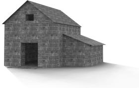
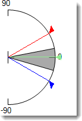
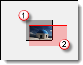

---
---

# 환경
{: #environment-tab}
환경은 실제 모델 지오메트리의 일부는 아니지만, 렌더링에만 나타나는 렌더링 요소들이 포함됩니다.
배경은 모델을 둘러싸고 있는 무한대의 구(球)라고 생각할 수 있습니다. 배경은 이 구에 투영됩니다. 배경 구는 선택 가능한 개체는 아니지만 배경 효과가 적용되는 참조 서피스입니다.
지반면은 모든 방향에서 정의된 고도로 위치가 지정된 이미지가 가로로 스트레치되는, 무한대의 가로 플랫폼을 제공합니다. 넓은 평면 서피스를 베이스로 사용하는 것보다 지반면을 사용할 때 렌더링 속도가 더욱 빨라집니다.

## 지반면
{: #ground-plane}

### 사용
{: #groundplane-enabled}
지반면을 켭니다.

*지반면이 꺼진 상태 (왼쪽), 켜진 상태(오른쪽).*

### 알파
{: #groundplane-alpha}
지반면에 투명한 알파 채널을 적용하여 다른 이미지로 그림자를 투사하여 합성할 수 있습니다. 참조: [Wikipedia 항목: Alpha compositing](http://en.wikipedia.org/wiki/Alpha_compositing).

 *지반면에는 그림자가 보이지만, 이미지에서는 투명하게 보입니다.* 

### 고도
{: #groundplane-elevation}
지반면의 높이를 0보다 높게 설정합니다.

*0보다 높은 지반면 고도.*

### 재질
{: #groundplane-material}
[재질](simple-material-properties.html)을 지반면에 적용합니다.

*높은 고도와 물 재질이 적용된 지반면.*

## 배경
{: #background-colors}
 **안내**: 컬러 배경은 언제나 켜져 있는 상태이지만, 이미지 또는 다른 배경 뒤에 숨겨진 상태일 수 있습니다.

### 강도
{: #background-intensity}
배경의 상대적인 밝기를 수정합니다.

## 배경 종류
{: #background-type}
렌더링 이미지에서 배경을 채울 색 구성표를 지정합니다. 배경의 유형은 다음과 같습니다.

> [하늘](environment-tab.html#환경-하늘) 
> [단색과 그라데이션 색](environment-tab.html#색과-그라데이션-배경) 
> [이미지](#environment-image) 
> [HDR과 평면형 HDR 이미지](environment-tab.html#hdr과-평면형-hdr-배경) 

## 하늘
{: #environment-sky}
하늘 환경은 [조명](lighting-tab.html) 탭의 태양과 하늘 설정을 사용합니다.

*자동 (왼쪽), HDR 이미지와 태양 (오른쪽).*

## 색과 그라데이션 색
{: #environment-color-and-gradient}
배경색은 항상 표시되지만, 이미지에 가려진 상태일 수도 있습니다.

### 단색
{: #solid-color}
단색 배경은 배경이 하나의 색으로 채워져 있습니다.

*단색 배경.*

### 2색 그라데이션
{: #two-color-gradient}
 **안내: 2색과 3색 그라데이션 배경은 투시 뷰에서만 적용됩니다.
2색 그라데이션 배경은 선택된 2색의 단계적 변화로 배경을 표시합니다.

*2색 그라데이션 배경: 파랑과 노랑.*

### 3색 그라데이션
{: #three-color-gradient}
3색 그라데이션 배경은 선택된 3색의 단계적 변화로 배경을 표시합니다.

*3색 그라데이션 배경: 파랑, 흰색, 노랑.*

## 색 제어
{: #enviroment-sky-color-controls}
색 견본을 클릭하면 [색 선택](select-color.html) 대화상자가 열립니다.
편집 상자는 색이 가장 진하게 표시되는 각도를 가리킵니다.

##### 그라데이션 색을 변경하려면

>색을 설정하려면 [색 선택](select-color.html) 대화상자에서 색 견본을 클릭합니다.

##### 그라데이션 색의 범위를 변경하려면
{: #colorrange}
현재 뷰포트가 투시 투영인 경우, 위 아래 색과 뷰와 관련된 그라데이션의 범위는 제어할 수 있습니다.

>수평선의 위 아래 각도를 위, 가운데, 또는 아래 상자에 도 단위로 입력합니다.

또는 각도 그래픽에서 각도 마커를 마우스로 끌어옵니다.
각도의 폭이 흐린 회색 음영 부분으로 그래픽에 표시됩니다.
배경으로 채워지는 각도는 흐린 회색 음영 부분으로 그래픽에 표시됩니다.
빨간색 깃발은 위쪽으로 지정된 색이 가장 진하게 표시되는 각도를 나타냅니다.
파란색 깃발은 아래쪽으로 지정된 색이 가장 진하게 표시되는 부분을 나타냅니다.
3색 그라데이션의 경우, 초록색 깃발이 가운데 색이 가장 진하게 표시되는 부분을 나타냅니다.

###  **위 아래 색 바꾸기** 
그라데이션 되는 색의 순서를 바꿉니다.

###  **뷰와 일치하는 각도 설정** 
뷰포트와 일치하도록 그라데이션 범위의 각도를 설정합니다.

## 이미지
{: #environment-image}
배경 이미지는 배경에 투영됩니다.
디지털 사진, 스캔한 이미지, 이미지 편집 소프트웨어에서 만든 이미지를 사용할 수 있습니다. 가장 좋은 결과를 얻으려면 고해상도 이미지를 배경에 사용하십시오. 자연스런 초점과 원근감을 표현하기 위해 선명한 이미지를 조금 흐리게 처리하는 것도 좋은 아이디어입니다.

>기존 컨텍스트에 모델을 배치합니다.
>도시 전경이나 산의 스카이라인을 추가합니다.
>초현실적인 효과를 추가합니다.

이미지는 평면형, 원통형, 구 형태로 매핑하거나, 시각적 그래픽 또는 좌표를 사용하여 간격을 띄우는 방법으로 매핑할 수 있습니다.

## 이미지 속성
{: #image-properties}

>이미지를 선택하려면 **여기를 클릭하여 지정** 단추를 클릭합니다.


### 투영
{: #backgroud-image-projection}
세 가지 유형의 배경 이미지 투영 ([평면형](environment-tab.html#평면형), [원통형](environment-tab.html#원통형), [구 형태](environment-tab.html#구-형태) )가 지원됩니다. 각각의 투영 방식에는 이미지의 위치를 지정하는 자체적인 제어 설정이 있습니다.

#### 평면형
{: #backgroud-image-planar}
평평한 배경에 이미지를 투영합니다.

분홍색 직사각형을 마우스로 끌거나 숫자를 입력하여 배경 이미지를 이동하거나 크기를 조정합니다.
 *Background area (1), image size and shape (2).* 

#### 평면형 옵션

##### X방향크기 / Y방향크기
배경 이미지의 크기를 지정합니다.

##### X간격띄우기 / Y간격띄우기
뷰포트의 왼쪽 아래 모서리를 기준으로 배경 이미지가 떨어져 있는 간격을 지정합니다.

#### 원통형
{: #cylindrical}
원통형 투영은 모델을 둘러싸고 있는 상상 속의 원통에 이미지를 매핑합니다. 이 투영 방법은 실제로 원통형인 이미지에 가장 적합하지만, 사진을 기반으로 구성된 일반적인 파노라마에도 잘 적용됩니다.
이미지 맵의 높이와 너비 각도의 크기 및 위치를 지정합니다. 그래픽 도구와 마우스를 사용하여 이미지의 위치와 크기를 지정합니다. 현재 원뿔형 표시기는 옅은 회색으로 음영 처리된 영역으로 표시됩니다.

#### 원통형 옵션
{: #cylindricalprojectionoptions}

#####  [배경색](environment-tab.html#배경색) 

##### 너비
이미지 맵의 각도 너비를 지정합니다. 각도를 입력하거나, 제어 위젯에서 플래그를 끌어 너비를 지정합니다. 파란색 영역은 각도 너비 범위를 나타냅니다.

##### 위 / 아래
이미지의 세로 범위를 지정합니다. 각도를 입력하거나, 제어 위젯에서 플래그를 끌어 위 아래 각도를 설정합니다. 원통형 투영은 수평선을 기준으로 45도 초과 또는 미만으로 제한됩니다.

##### 회전
이미지 회전과 범위를 지정합니다. 각도를 입력하거나, 제어 위젯에서 끌어 회전을 설정합니다. 빨간 점은 이미지의 중심을 나타냅니다. 회색 영역은 뷰를 나타냅니다.

#####  **뷰로부터의 각도** 
뷰포트와 일치하도록 **너비**와 **위/아래** 각도를 설정합니다.

#### 구 형태
{: #spherical}
구(球) 형태 투영은 이미지를 완전한 구체로 매핑합니다. 이 방식은 일반적으로 등장방형인 구 형태 이미지를 사용할 때 좋은 결과물을 만들어냅니다.

#### 구 형태 옵션
{: #sphericalprojectionoptions}

##### 회전
이미지의 회전을 지정합니다. 빨간 점은 이미지의 중심을 나타냅니다.

#####  **뷰로부터의 각도** 
회전 각도를 뷰포트와 일치하도록 설정합니다.

## HDR과 평면형 HDR 배경
{: #hdr-and-planar-hdr-backgrounds}
HDRI(High-dynamic-range images)는 이미지에 저장된 휘도 정보를 기반으로 조명을 설정합니다.
HDR 이미지를 환경으로 사용하면 조명과 배경의 관계 그리고 이미지에 있는 다른 조명을 보다 상세하게 설정할 수 있습니다. 이 옵션은 밝은 실외가 창으로 보이는 실내 공간을 표현할 때 특히 유용합니다.
HDR 환경 이미지는 일반적인 비트맵 이미지보다 훨씬 넓은 범위의 빛 정보를 가지고 있으며, 채널을 적용할 수 있어 [다중 채널](lights-tab.html#채널) 렌더링에서 명암을 관리할 수 있습니다.

## HDR 옵션
{: #background-hdr-options}

>이미지를 선택하려면 **여기를 클릭하여 지정** 단추를 클릭합니다.


## 평면형 HDR 옵션
{: #planar-hdr-options}
평면형 HDR (high-dynamic-range) 이미지는 이미지 배경과 조명 모두를 제공합니다. 건축 렌더링에서 실외에서 들어오는 빛이 필요한 창 바깥쪽에 자주 사용됩니다.

>이미지를 선택하려면 **여기를 클릭하여 지정** 단추를 클릭합니다.

### 
*배경 이미지 (왼쪽)와 평면형 HDR (오른쪽)을 비교하면 배경에서의 은은한 조명의 차이를 알 수 있습니다.*

## 고급 배경
{: #advanced-background}
**고급 배경** 설정은 렌더링에 보이지는 않지만 개체에 반사되거나 굴절되는 환경을 제어합니다.
그림에서 배경은 검정색이지만 반사된 환경은 빌딩 실내의 HDR 이미지입니다.

## 반사
{: #advanced-background-reflected-sky}
반사된 환경은 렌더링된 이미지에는 보이지 않으나 반짝거리는 개체에 반사되어 보입니다.

*보통 환경 (왼쪽), 반사된 HDR 하늘 환경 (오른쪽).*

### 하늘
[조명: 태양과 하늘](sun-and-sky-tabs.html) 설정에서 지정된 대로 개체에 하늘이 비춰집니다.

### 사용자 지정
개체가 [색 또는 그라데이션](environment-tab.html#색과-그라데이션-배경), 이미지, 또는 HDR 배경을 반사합니다.

### 보이는 배경
[환경](environment-tab.html) 설정에서 지정된 상태로 보이는 배경이 개체에 비춰집니다.

## 굴절됨
{: #advanced-background-refracted-sky}

### 하늘
[조명: 태양과 하늘](sun-and-sky-tabs.html) 설정에서 지정된 대로 개체가 하늘을 굴절시킵니다.

### 사용자 지정
개체가 [색 또는 그라데이션](environment-tab.html#색과-그라데이션-배경), [이미지](environment-tab.html#이미지), 또는 [HDR](environment-tab.html#hdr과-평면형-hdr-배경) 배경을 굴절시킵니다.

### 보이는 배경
[환경](environment-tab.html) 설정에서 지정된 상태로 보이는 배경이 개체에 굴절됩니다.

### 투명한 개체 알파 없음
{: #no-transparent-alpha-objects}
투명한 개체를 통해 알파 채널이 보이는 것을 방지하고, 투명한 개체를 통해 알파 채널이 합성되는 것도 방지합니다.
이미지가 알파 채널로 붙여넣기 실행이 된다면 이 설정을 끕니다.
