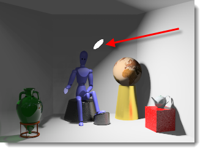

---
---

# Lights
인공 광원은 몇 가지 속성이 추가된 일반적인 Rhino 조명을 사용하여 배광을 제어합니다. 광원을 사용할 때 실제 램프와 가장 유사한 유형을 선택하십시오.

## Note

>Rhino **Directional Lights** are not supported. They do not appear in the list of lights and cannot carry Flamingo nXt properties.

### LinearLight
{: #linearlight}
{: #rhino-light-commands}
형광등과 같은 원통형 패턴으로 조명을 배광합니다.

### PointLight
{: #pointlight}
조명을 모든 방향에서 균등하게 배광합니다.

### RectangularLight
{: #rectangularlight}
산광기(디퓨저) 또는 칸막이(배플)를 사용한 매립등과 유사하게 표현됩니다.

### Spotlight
{: #spotlight}
빔 각도와 방향을 제공합니다.

### Tag objects as lights
{: #tag-objects-as-lights}
렌더링할 수 있는 모든 개체 (서피스, 솔리드 등) 는 조명 개체로 태그를 지정하고 조명 속성을 부여할 수 있습니다.
조명으로 태그된 개체는 조명이 향하는 곳과 위치를 나타내는 미리보기 위젯을 표시합니다.

##### To control the visibility of light widget

>On the **Flamingo nXt menu &gt; Lights &gt;** check **Show light widgets on tagged objects** or use the [FlamingoNXtDrawLightsForObjectsTaggedAsLights](flamingo-command-list.html#flamingonxtdrawlightsforobjectstaggedaslights) command

## Light Properties
{: #light-properties}
Flamingo가 Rhino의 현재 렌더링 응용 프로그램일 때, 조명에 추가 속성을 설정할 수 있습니다. 조명의 일부 속성은 공통적이지만, 모든 속성이 그러한 것은 아닙니다.
Some light properties are displayed on the Lights tab as a matrix: [On/Off](lights-tab.html#on), [Name](lights-tab.html#name), [Distribution](lights-tab.html#light-distribution), [Aim](lights-tab.html#aim-light), [Watts](lights-tab.html#watts), and [Channel](lights-tab.html#channel).

### 이름
{: #name}
조명 개체의 이름.

### On
{: #on}
조명의 켜짐/꺼짐 상태를 전환합니다.

### Visible
{: #visible}
조명 개체 자체가 렌더링된 이미지에 표시됩니다.

### Light distribution *( [Tagged objects only](#tag-objects-as-lights) )* 
{: #light-distribution}
배광 패턴을 지정합니다.

#### All Directions
점 조명을 시뮬레이션합니다.

#### Diffuse
직사각형 조명을 시뮬레이션합니다.

#### Spot
집중 조명을 시뮬레이션합니다.

### Aim light *( [Tagged objects only](#tag-objects-as-lights) )* 
{: #aim-light}
조명 대상을 원하는 위치로 끌어옵니다.

### Watts
{: #watts}
전력 사용을 지정합니다.

### Beam angle *( [Spotlights only](lights-tab.html#spotlight) )* 
{: #beam-angle}
광원으로부터 빛이 나오는 너비의 각도.

### Radius *( [Spotlights only](lights-tab.html#spotlight) )* 
{: #radius}
조명의 크기. 조명이 작을수록 더 선명한 그림자가 생깁니다.

### Color
{: #color}
조명의 색.

#### Use material color *( [Tagged objects only](#tag-objects-as-lights) )* 
조명에서 나오는 빛에 조명 개체에 적용된 재질의 색을 사용합니다.

### Channel
{: #channel}
조명의 8개 채널 중 하나를 지정합니다.
다중 채널 렌더링에서 채널의 수를 지정합니다.
렌더링 작업이 완료된 후 렌더링된 이미지에서 실시간으로 조명을 조정할 수 있습니다. 도면에 있는 각 광원 (태양과 하늘 포함)을 채널로 지정할 수 있습니다. 이미지가 렌더링되면 저장하기 전에 각 채널은 렌더링 창에 개별적으로 조정되며, nXtImage 파일로 저장하여 나중에 편집할 수 있습니다. 이 기능을 활용하여 하나의 렌더링으로 낮과 밤의 실내 이미지를 만들어낼 수 있습니다.
클릭하여 동영상을 재생합니다.
다중 채널 이미지를 만들고 조작하려면 다음의 조건들이 필요합니다.

>All participating lights must be on.
>Each light source must be assigned a channel. By default, Sun and Sky are set to channel 0.
>The only saved format that preserves this channel information is the .nXtImage format. Lighting can be adjusted there and then the image saved to a bitmap format.

## Additional options
{: #additional-options}

> [id="a13" style="position: relative;">Right-click]() a light in the **Lights** tab for additional options

####  [On](lights-tab.html#on) 

#### Delete
선택된 조명을 삭제합니다.

#### Remove light tag
Removes the [tag](lights-tab.html#tag-objects-as-lights) that makes an object a light.

####  [속성](lights-tab.html#light-properties) 

#### Select objects and matching items
뷰포트에서 조명을 선택합니다.

## IES 파일
{: #iesfile}
IES (Illuminating Engineering Society) 파일은 광원의 배광을 정의하는 광도 측정 파일입니다. 조명 기구 제조사들이 이런 파일을 제공하는 경우가 많습니다. IES 파일로 배광을 정의하여 광원을 보다 정확하게 묘사할 수 있습니다. 조명으로 태그된 개체 지오메트리는 배광과 무관합니다. 배광의 정의는 광도 측정 파일에서만 지정됩니다.

## Notes:

>Flamingo nXt supports Type C goniometry files, which includes the majority of IES files. Type A, which are occasionally used by the automobile industry to define headlights, and Type B files, which are sometimes used to define floodlighting, are not supported.
>IES distributions include the effects of light fixture elements such as baffles, reflectors, and diffusers.
>IES distributions are often asymmetrical, so the process of aiming the source includes not just a target, but a rotation angle as well.

### Brightness from file
Use the intensity stored in the IES file. If this is not checked, the ** [Watts](lights-tab.html#watts) ** setting is used.
