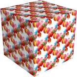

---
---

# 개체 속성
Flamingo nXt 개체 속성은 Flamingo nXt에서 개체를 렌더링하는 방식에만 영향을 미칩니다.

## 알파 채널
{: #alpha-channel}
개체를 안 보이게 만듭니다. 투사되는 그림자와 개체에 보이는 그림자는 렌더링됩니다. 이미지는 다른 이미지와 겹쳐질 수 있으며, 그림자는 합성 이미지에 표시됩니다.

A few simple planar surfaces that match the image were created in order to catch shadows cast on the building by the &quot;trees.&quot; The planes were tagged with the Alpha channel property so when they were rendered, they were invisible, but still displayed the shadows. This partially transparent image was then overlaid onto the image.

## Caustics
{: #caustics}
The light rays reflected or refracted by a curved object or the projection of those rays on another surface. See [Wikipedia article: Caustic (optics)](http://en.wikipedia.org/wiki/Caustic_(optics)) for more information.

*Caustics produced by a glass of water.*

*Without caustics (left), and with caustics (right).*

## Thin
{: #thin}
A space-enclosing, transparent object is normally treated as a solid for transparent refraction. Setting the **Thin** property means that each surface will be treated as a two-sided object for refraction.

*Box and torus.*
Normal (left) and Thin (right).

## Daylight portal
{: #daylight-portal}
A daylight portal is an opening for [Sun and Sky lighting](lighting-tab.html#interior-daylight) for an interior rendering.
A Daylight portal pulls sun, sky, and ground light into an interior space in a natural way. Daylight portals only have an effect when the [Sun](sun-and-sky-tabs.html#sun) is turned on.
When the lighting scheme is set to [Interior daylight](lighting-tab.html#interior-daylight), all transparent surfaces act as daylight portals automatically. It is only when the lighting scheme is set to Studio or Exterior daylight and you still want to bring outside sun and sky light into an interior space that you must manually tag the windows as daylight portals.

*With daylight portal (left), without daylight portal (right).*

## Mapping
{: #mapping}
레이어나 개체에 재질이 적용되면, 매핑은 재질이 특정 개체에 어떻게 위치(매핑)하는지를 제어합니다. 눈의 띄는 패턴이 없는 재질은 일반적으로 매핑을 제어할 필요가 없습니다. 재질에 특정한 방향이 있거나 분명한 패턴이 있다면 매핑을 사용합니다. 이 경우에도 기본 매핑으로 충분합니다. 매핑은 개체와 함께 유지되고 개체가 이동/회전/크기 조정되면 그에 맞춰 따라갑니다.
한 가지 일반적인 예로, 수레바퀴살처럼 원형 패턴으로 개체에 적용된 나무 재질을 들 수 있습니다. 나무의 방향이 일부 살에서 올바르게 지정되지 않을 수도 있습니다. 이 경우, 사용자가 직접 위치를 정하고 개체상의 재질 방향을 지정합니다. 매핑을 변경해도 재질의 정의는 달라지지 않으며 적용된 방향만 달라집니다.
Default mapping (left) and mapping orientation set per object (right).
Five mapping types position a material on an object: [Planar](#planar), [Cube](#cube), [Cylindrical](#cylindrical), and [Spherical](#spherical), and [Surface](properties-object.html#surface-mapping). The [Default](#defaultmapping) setting maps materials the same as cube, but the origin and orientation are not adjustable.
일단 특정한 매핑 유형이 설정되면, 개체를 회전, 이동, 편집할 수 있으며 재질의 방향도 개체를 따릅니다. 개체상에서 점을 지정할 때 재질을 매핑하기 전에 개체 스냅을 사용하거나 구성평면을 개체로 설정하는 것이 중요합니다.

### Place/Edit Placement
원점과 개체의 재질 매핑 회전 방향을 설정합니다. 비트맵 이미지가 어디에서 시작하는지를 제어합니다.
매핑 유형별로 다른 제어 아이콘이 활성화됩니다. 원통형과 구 형태 매핑에서는 형상의 중심에 원점을 설정하는 것이 일반적으로 중요합니다.

### 기본값
{: #defaultmapping}
절대좌표축에 대하여 직각으로 패턴을 매핑합니다. 패턴은 절대좌표 0,0,0에서 시작합니다. 원점이나 방향을 변경할 수 없습니다. 이것은 패턴은 개체 경계의 바깥쪽 어딘가에서 시작하고 끝나야 함을 뜻합니다.

### Planar
{: #planar}
Mapping will not change orientation as the sides of the object change. If&#160;the object has faces that are perpendicular to the mapping plane, the material appears to be &quot;extruded&quot; or &quot;projected.&quot; In some cases, the **Planar** mapping can result in the pattern switching orientation suddenly in areas of high curvature.

### Cube
{: #cube}
패턴을 개체에 대하여 직각으로 매핑합니다. 원점과 재질 매핑의 방향은 변경할 수 있습니다.

### Cylindrical
{: #cylindrical}
지정된 원점 위치에 중심이 있는 원통에 적용하는 것처럼 패턴을 매핑합니다. 매핑의 중심점, 회전, 축을 변경할 수 있습니다.
재질 크기를 사용하거나, 재질 크기를 재설정하고 U 방향(원의 방향)에서 타일의 수와 높이를 지정합니다.

### Spherical
{: #spherical}
지정된 원점 위치에 중심이 있는 구(球)에 적용하는 것처럼 패턴을 매핑합니다.

### Surface
{: #surface-mapping}
타일 처리되지 않는 재질이지만, 재질 크기와 상관없이 각각의 서피스에 하나의 재질 인스턴스만 배치할 수 있습니다.

